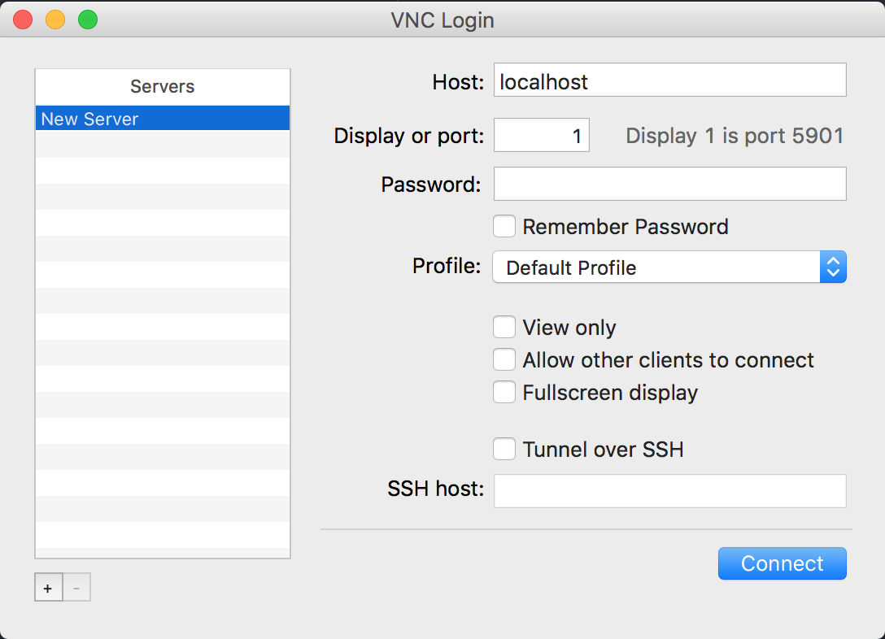
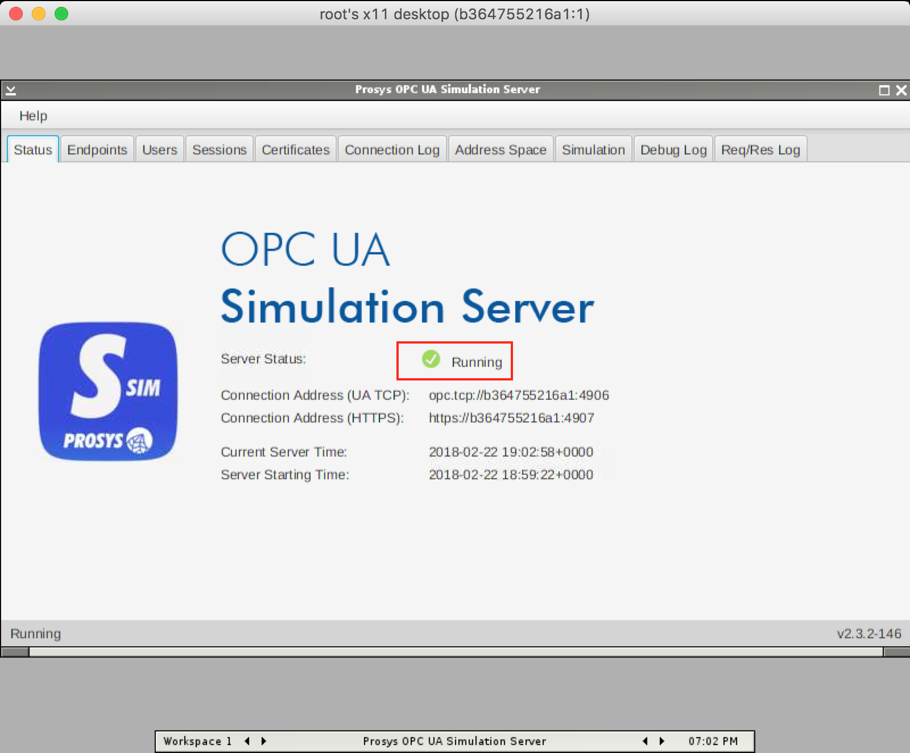
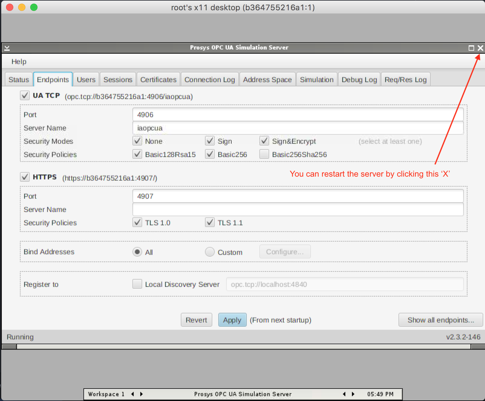
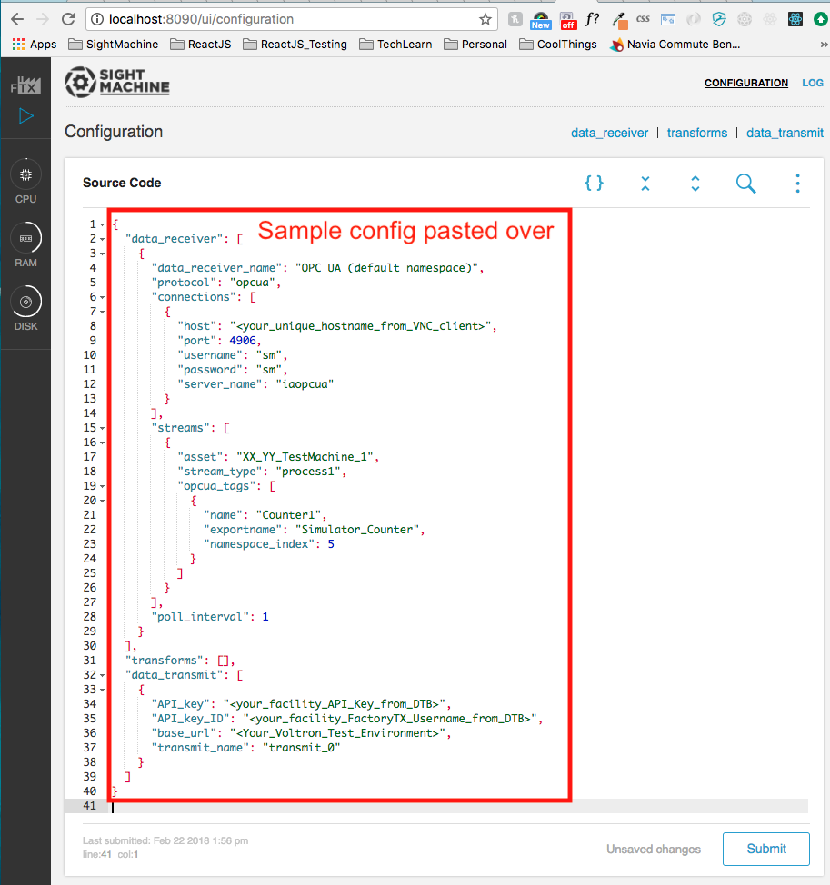
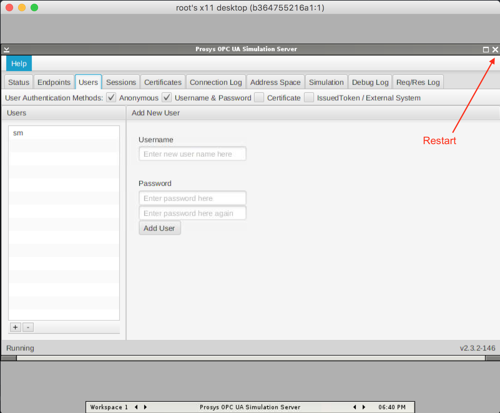
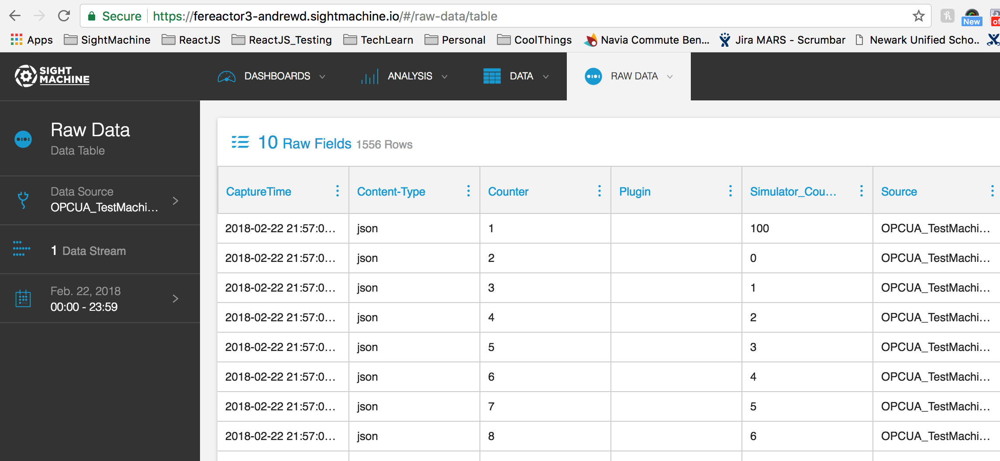

# Prosys OPC UA Simulation Server

The Dockerfile in this directory builds a container with the Prosys OPC UA
simulation server. The simulation server makes it easy to test OPC UA clients
against different data types, namespaces, and authentication systems.

# Using the Simulation Server

First, change your directory to 
factorytx-core/tools/prosys-opc-ua-simulation-server, where the Dockerfile is. 
Then, you can build and run the simulator as follows:
```sh
$ IMAGE=prosys-opc-ua-simulation-server:latest
$ docker build -t $IMAGE .
$ docker run -p 5901:5901 -p 4906:4906 -p 4907:4907 --name prosys-opcua $IMAGE
```
Next, download and install a VNC client to use on your computer 
(e.g. [Chicken](https://sourceforge.net/projects/chicken/) for MacOS, 
or [RealVNC](https://www.realvnc.com/en/connect/download/viewer/)).

Open Chicken VNC and click `Connect` with the default config (Host = `localhost` and port = `1`).


If your OPC UA server is correctly running, you will land on the **Status** tab 
in Chicken VNC. The Server Status will be displayed as `Running`.


By default the simulator exposes an OPC TCP server on port 4906 and an OPC 
HTTPS server on port 4907. These ports and other settings can be reconfigured 
live via a VNC client on port 5901. If you make changes through the GUI, you can 
restart the simulator without stopping docker by clicking the upper-right corner 
"X" button on the window frame, and the simulator will stop and then restart 
automatically.


Additional resource(s):

- [Prosys OPC UA Simulation Server User Manual](https://www.prosysopc.com/opcua/apps/JavaServer/dist/2.3.2-146/Prosys_OPC_UA_Simulation_Server_UserManual.pdf))

# Manual Testing: Connecting the Simulation Server

- Open up another tab in your terminal console and change your current directory 
to factorytx-core.  Then start the factorytx container normally with the command:
```sh
$ FTX_NOAUTH=TRUE docker-compose -f docker-composdoe-local.yml up --build
```
- Start a new browser window or tab and navigate to 
localhost:8090/ui/configuration. Stop the FTX service if it is running.  If you 
have an existing FTX config, it will be displayed here and you will have to copy 
the config file (i.e., factorytx.conf) from `factorytx-core/conf.d/` to another 
location in your system before proceeding to the next step.
- Copy the whole content of 
`factorytx-core/tools/prosys-opc-ua-simulation-server/sample-opcua-ftx-config` 
and paste it over the existing config in FTX.

- Replace the placeholders in the FTX config with your own info.
- Your simulation server should already be started in the "Using the Simulation 
Server" section above
- **(!)** Connect the docker networks:
```bash
# Get a list of the running containers. We are interested in the name of the 
# Prosys Simulation server's container (e.g. "prosys-opcua"). Note: If you don't 
# specify a name for the Docker container, a name will be randomly assigned.
> docker ps
CONTAINER ID        IMAGE                                    COMMAND                  CREATED             STATUS              PORTS                                                                     NAMES
ca83af27f7fc        prosys-opc-ua-simulation-server:latest   "supervisord -c ./su…"   36 seconds ago      Up 35 seconds       0.0.0.0:4906-4907->4906-4907/tcp, 4096-4097/tcp, 0.0.0.0:5901->5901/tcp   prosys-opcua
feffb40c4958        sightmachine/factorytx-core              "./entrypoint.sh sh …"   13 minutes ago      Up 13 minutes       0.0.0.0:7564->7564/tcp, 8090/tcp                                          factorytx-dev
f8258871515b        sightmachine/factorytx2-nginx            "nginx -g 'daemon of…"   19 hours ago        Up 13 minutes       0.0.0.0:80->80/tcp, 0.0.0.0:8090->80/tcp                                  factorytx-core_nginx_1

# Get a list of docker networks
> docker network ls
NETWORK ID          NAME                     DRIVER              SCOPE
d03286e37073        bridge                   bridge              local
4bcbc44bbb21        factorytx-core_default   bridge              local
cc1685c4a4bc        host                     host                local
33cabfefb0e6        none                     null                local

# Connect the simulation server to factorytx's network (e.g. "factorytx-core_default"):
docker network connect factorytx-core_default prosys-opcua

# Confirm that the container has been added to the network by inspecting the 
# factorytx network:
docker network inspect factorytx-core_default

# "Containers" should be a list like:
# "Containers": {
#   "ca83af27f7fce11fd674239839a3e2d4b3629e5547a8311c751f5d69f004d9bd": {
#       "Name": "prosys-opcua",
#       "EndpointID": "827a891021739c1020757942de13c95294957ace9b5e4743c05e4c52979dccec",
#       "MacAddress": "02:42:ac:14:00:04",
#       "IPv4Address": "172.20.0.4/16",
#       "IPv6Address": ""
#   },
#   "f8258871515b35eea36788a421329605947b8089fb1125d08d0e1538408b29f0": {
#       "Name": "factorytx-core_nginx_1",
#       "EndpointID": "48bd1b433c22746152cd40468be574639becfe0594c4ac16f1fc5dd403d5bbd4",
#       "MacAddress": "02:42:ac:14:00:02",
#       "IPv4Address": "172.20.0.2/16",
#       "IPv6Address": ""
#   },
#   "feffb40c49582d8065810af6b32b64b0b01a98af1bf79d4131518c83d87fe624": {
#       "Name": "factorytx-dev",
#       "EndpointID": "a9fa3e4e0c1ed1f2bba1f6a49cbe011803a1d1c6a333a6ece84d691dff0066b1",
#       "MacAddress": "02:42:ac:14:00:03",
#       "IPv4Address": "172.20.0.3/16",
#       "IPv6Address": ""
#   }
# }
```

# Manual Testing:  Configure the Simulation Server

- Back to your Chicken VNC client.  On the **Certificate** tab of Chicken VNC, 
one of the certificates has a random alphanumeric string that is the hostname of 
the opc ua server (e.g., `886533d0317b`). Type that exactly into the ‘host’ 
field of your FTX config.
- On the **Endpoints** tab of Chicken VNC, enter `iaopcua` for ServerName under 
UA TCP section. This will match `"server_name": "iaopcua"` in your FTX config.  
Click `Apply`.
- On the **Users** tab of Chicken VNC, add a user with the username and password 
matching that in the FTX config (i.e., sm).  You can add a different username 
and password here, as long as you change the appropriate fields in your FTX 
config accordingly.  After adding a user, check ‘Username & Password’ box at the 
top.
- Click the "X" in the top-right corner to close the OPC Simulation server 
(**NOT** the VNC window!).  The server should restart automatically with your 
new configuration.


# Manual Testing: Configure Tags

- In Chicken VNC, go to Address Space > Objects > Simulation > (click on an object, eg "Counter1")
- Expand "NodeId" on the right.
- From the Node ID window, you will want the NameSpace Index (`5` in my case) 
and the Identifier (`Counter1` in my case)
- Those values can be filled into an FTX Config block like this, in the UI:
```
"streams": [
{
  "asset": "XX_YY_TestMachine_1",
  "stream_type": "process1",
  "opcua_tags": [
    {
      "name": "Counter1",
      "exportname": "Simulator_Counter",
      "namespace_index": 5
    }
  ]
}]
```
# Manual Testing:  Running FTX

- Back to FTX browser window.  Click `Submit` in the lower right corner of FTX 
to save the newly modified FTX config. If you had a previous config, this will 
overwrite it; hence, you were advised to copy the existing config to another 
location one of the steps above.
- The FTX service should be started automatically after you click `Submit`.  
Click on the `LOG` link in the upper right corner to see data being saved to the 
spool and transmitted.
- Log into the testing environment specified as `base_url` in your FTX config.  
On the Top Nav, click Raw Data > Raw Data Table.
- Sidebar > Data Source Picker > Select your OPC UA data source
- Sidebar > Date Picker > Select the date of your test
- Sidebar > Click `Update` button.  You should see data.  Congrats!  You have 
successfully set up an OPC UA Simulation Server and tested FTX's opcua protocol.

